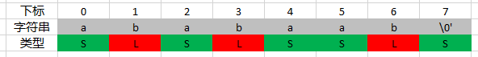

# 后缀数组

[TOC]

#  简介

这篇文章讲什么?

- 主要是讲SA-IS后缀数组算法

学会什么？

-  如何写SA-IS算法
-  如何使用height数组
- A题

# 基础

首先需要注意后缀数组经常用到的以下几个概念。

- `sa[]`  是一个数组，使用的时候，注意`sa`数组下标的含义是指名次。比如`sa[3] = 4` 表示的是排第3名的字符串位于原来数组下标的4。
- `rank[]`也是一个数组，表示的是名次。`rank[4] = 3`表示的是数组下标为4的字符串排名为3。
- `height[]`也是一个数组，表示的是`height[i]` 表示`sa[i-1] 与sa[i]`的公共的长度。
- `n`这里是指把'\0'也当成一个字符。所以s[n-1] = '\0'.

# 后缀的概念

注意，通常在处理字符串的时候，都是按照C字符串来处理的。就是把最后的'\0'也算进去。比如，给定字符串`abc\0` 可以得到。

```
abc\0
bc\0
c\0
\0
```

后缀数组就是求这些字符串排序之后的顺序。

# 数组的含义

比如现在有一个字符串`abracadabra\0`形成的后缀，排好序之后的结果就是

```C
0 
0 a
1 abra
4 abracadabra
1 acadabra
1 adabra
0 bra
3 bracadabra
0 cadabra
0 dabra
0 ra
2 racadabra
```

其中左边的列表示的是`sa[i-1]与sa[i]`的公共前缀长度。

# SA-IS算法

## 思路

虽然论文里面说了很多，各种博客也说了很多。本质上来说，就是找到一些关键的哨兵元素，当把哨兵元素排好序之后，直接可以把余下的元素排好序。所以总的来说，算法分为两部分：

-  把哨兵元素排好序
- 根据哨兵元素把余下的元素排好序。

# 详细解释

 虽然原来的论文是《Linear Suffix Array Construction by Almost Pure Induced-Sorting》。但是易于理解的还是一个英文的。但是最终让我看懂的还是一个英文的网站。https://zork.net/~st/jottings/sais.html

这里直接开始讲如何操作，并不去看太多数学上的正确性证明。

## L类型与S类型

首先需要定义两种类型，`L_TYPE`  与`S_TYPE`。`L_TYPE`表示原字符串中`s[i] > s[i+1]`，而`S_TYPE`表示`s[i] < s[i+1]`。实际上，当给定一个字符串的时候，很容易把每个位置的类型计算出来。算法如下：

```C
void sais(int n, int m, int *s, int *t, int *p) {
    int n1 = t[n - 1] = 0, i = 0;
    for (i = n - 2; ~i; i--)
        t[i] = s[i] == s[i + 1] ? t[i + 1] : s[i] > s[i + 1];
}
```

注意，这里参数的含义:

- `s[]`表示原本的字符串。只是这里用了整型来表示。因为有的题目里面给定的是一个整数的数组，不是字符串，为了通用性，所以这里用整数。
- `t[]`用来存放每个位置的类型
- `p[]`只用来存放`S_TYPE`类型的下标
- 如果相等，那么t[i]就抄t[i+1]的类型。如果s[i] > s[i+1]，那么就取L_TYPE (large type)，也就是说s[i]大于s[i+1]。与之对应的是S_TYPE即(small_type).

首先看第一步的操作。

```C
    int n1 = t[n - 1] = 0, i = 0;
    for (i = n - 2; ~i; i--)
        t[i] = s[i] == s[i + 1] ? t[i + 1] : s[i] > s[i + 1];
```

首先将`s[n-1] = '\0'`即位置处标记为`S_TYPE`。因为`'\0'`是整个数组里面最小的。然后再从右往左处理每个字符。需要注意的是，如果`s[i] == s[i+1]`，那么`t[i] == t[i+1]`。经过处理之后，`T[]`数组如下



## LMS字符

接下来就是要处理关键的哨兵字符，那么首先要定义什么的是哨兵字符。但是原文中并不把这个字符叫哨兵字符，而是叫做LMS字符。

- `s[0]`字符无论是什么类型，肯定不是LMS字符。
- 如果左边是`L_TYPE`，自己是`S_TYPE`，那么就是LMS字符。可以记为`往下掉`的字符位置。

## LMS字符的位置

定义了什么是LMS字符，接下来就需要记录下LMS字符的初始rank以及相应的位置。

```C
    rk[0] = -1
	for (i = 1; i < n; i++)
        rk[i] = (t[i - 1] && !t[i]) ? (p[n1] = i, n1++) : -1;
```

根据前面的，`s[0]`不是LMS字符（这是规定）。这里从`i=1`从前往后遍历，如果是LMS字符，那么就把初始的rank依次标记过去。否则就是标记为-1。而`p[]`数组里面会记录每个LMS字符的位置。


- `rank[]`数组里面记录是第几个LMS，从0开始。
- `p[]`数组里面记录LMS字符的下标。

## LMS的排序

本来是有很多种方法对LMS字符进行排序，但是这里采用了一个`O(n)`的办法。从而可以在排完序之后得到哨兵元素的后缀数组。这个`O(n)`的办法叫`induce_sort`。

在接下来填数据的部分很像在填一个桶。**所以下文描述的时候，`bucket = sa[]`数组**。相当于`sa[]`数组的一个别名。

### 计数

首先要统计原字符串中每个字符个数。

```C
    memset(sa, -1, sizeof(int) * n);                     \
    memset(cnt, 0, sizeof(int) * m);                     \
    for (i = 0; i < n; i++) cnt[s[i]]++;                 \
```

运行完这段代码之后，就可以得到。


统计好字符个数之后，接下来就希望把下面这个bucket填好。


通过前面的`cnt[]`数组，我们知道了每个元素的个数。那么接下来就需要找到正确的位置把这些元素放回去。所以我们需要计算出每个字符的最后一个下标是多少。

```C
for (i = 1; i < m; i++) cnt[i] += cnt[i - 1];        \ 
```

当运行完之后。得到`cnt[]`数组为


此时，`cnt[]`数组里面记录的下标指向的并不是自己字符范围的末尾，而是下一个字符的开头。


接下来`cur[]`数组需要指向每个字符能放置的末尾。也就是指向红色方框的位置。


所以需要执行

```C
for (i = 0; i < m; i++) cur[i] = cnt[i] - 1;         \
```

此时，`cur[]`数组就会指向每个字符的末尾。

## 填充LMS字符

接下来，首先处理LMS类型的字符。由于只需要处理`p[]`数组。所以这里就从`n1`开始。

```C
#define pushS(x) sa[cur[s[x]]--] = x				 // x表示原字符串s[]的下标
for (i = n1 - 1; ~i; i--) pushS(v[i]);               \ // 此时v[]指向 p[]
```

也就是从后往前遍历`p[] = [2, 4, 7]`数组。把代码展开之后，执行的就是

```C
pushS(7);
pushS(4);
pushS(2);
```

那么执行完成之后的结果就是。


此时就完成了LMS字符的insert。那么接下来要处理`L_TYPE`。

## 利用bucket填充L_TYPE

接下来填充`L_TYPE`的时候，就从`bucket`的开头向后扫，注意，此时并不再使用原来字符串的`t[]`数组来扫描。

```C
    for (i = 1; i < m; i++) cur[i] = cnt[i - 1];         \
    for (i = 0; i < n; i++)                              \
        if (sa[i] > 0 && t[sa[i] - 1]) pushL(sa[i] - 1); \
```

这里扫bucket以及填bucket都是从前往后。所以需要记录每个字符的开始位置。这里在扫描的时候，需要注意：

- 需要`bucket[i]`里面有值` > 0`， (**注意**！并不是要求是LMS字符，而是`bucket[]=sa[i] != -1`)。
- 需要`t[sa[i]-1]`是一个`L`类型。那么就把这个下标填到`bucket`里面。


接下来，依次处理每个位置。处理完成之后可以得到。


## 利用bucket填充S_TYPE

此时，再利用已经填好的`bucket`里面的信息。再去填写`S_TYPE`。

```Cpp
    for (i = 0; i < m; i++) cur[i] = cnt[i] - 1;         \
    for (i = n - 1; ~i; i--)                             \
        if (sa[i] > 0 && !t[sa[i] - 1]) pushS(sa[i] - 1);
```

再次填充的时候，需要再根据`cnt[]`数组把每个`bucket`的尾巴算出来。然后这一次仍然是从后往前扫描。

- 需要`bucket[i] > 0`
- 需要`idx = bucket[i] - 1, 并且t[idx] = S_TYPE`

示例如下：


这里会把以前的值修改掉。那么经过一轮后向前的遍历之后，可以得到。


经过这一轮操作之后，就可以发现基本上大部分都被填上了。

但是这里只是第一轮`induce_sort`完成了。接下来还需要把LMS字符真正排好。

## 把原来的数组缩小

```C
    ch = -1;
	s1[n1 - 1] = s1[n1] = 0;
    for (i = 0; i < n; i++)
        if (~(x = rk[sa[i]])) {
            if (ch < 1 || p[x + 1] - p[x] != p[y + 1] - p[y])
                ch++;
            else
                for (j = p[x], k = p[y]; j < p[x + 1]; j++, k++)
                    if ((s[j] << 1 | t[j]) != (s[k] << 1 | t[k])) {
                        ch++;
                        break;
                    }
            s1[y = x] = ch;
        }
```

要看懂这段代码，首先需要了解一个概念叫`LMS substring`。

- LMS substring是指：以LMS字符串开头，到下一个LMS字符结束(not included)。比如


那么接下来需要将这些`sub string`进行排序。当排好序之后。就可以把每个`lms substring`重新命名成一个数，然后再把这个数字进行排序。这就是上面这段代码所做的事情。

在遍历的时候，由于出现了数组的多重引用。最终有意义的，实际上是`x`。

```C
x最终表示的是p[]数组的下标。
```

那么这里得到的`x`的序列就是`[2, 1, 0]`。相当于`p[]`的下标根据`sa[]`数组进行了排序。

- 第一次x = 2。`ch = -1`，所以`LMS sub string = '\0'`直接`ch++`，然后此字符串命名为0。然后`s1[y = 2] = 0`。
- 第二次x = 1。`ch = 0`，所以`LMS sub string = 'aab'`，此时`ch++`，然后这个字符串被命名为1，然后`s1[y = 1] = 1`
- 第三次x = 0。`ch = 1`, 此时需要跳到代码

```C
                for (j = p[x], k = p[y]; j < p[x + 1]; j++, k++)
                    if ((s[j] << 1 | t[j]) != (s[k] << 1 | t[k])) {
                        ch++;
                        break;
                    }
```

这里`j`指向当前的`sub string`的开头，`k`指向之前字符串的开头。然后依次比较这两个字符串。注意在比较的时候，

需要保证他们的字符，以及类型也是完全一样的。当发现不一样的时候，说明这两个字符中并不相同，`ch++`也就是命名需要新增。

- 所以这段代码有意思的是，条件`bucket[]顺序以及LMS类型`结合在一起的时候，就已经认为`LMS sub string`已经有序了!。

那么这里会比较的是当前的字符串`cur substr = "ab"`, 之前的字符串`pre substring = "aab"`，就可以得到`ch++`。

最终得到`s1[y = 0] = 2`。而`ch = 2, n1 = 3`（n1表示`lms char`的个数，在生成`p[]`数组的时候就确定了）。

### 实质

前面操作了那么多，可以发现`inducesort(p)` 在这里的主要作就是将`p[]`排好序。不过最终在取用的时候，使用的是排好序的下标。

那么操作完成之后，会把所有的结果都存放到`s1[]`数组里面。在这里，我是直接将

# 对子问题排序

在前面的操作中，实际上是将`lms sub string`进行了排序，但是没有将`lms suffix string`排好序。但是，由于`lms suffix string`是由`lms sub string` 片组成的。接下来就对这个子问题进行求解。

```C
    if (ch + 1 < n1)
        sais(n1, ch + 1, s1, t + n, p + n1);
    else
        for (i = 0; i < n1; i++) sa[s1[i]] = i;
```

这里要分两种情况。

- `ch + 1 < n1`这里的意思是说，如果在对前面的`lms sub string`在命名的时候，有完全重名的情况。那么就无法将所有的`lms suffix string (是suffix string不是sub string)`排好序。那么就需要进行递归处理。
- `ch + 1 == n1`说明每个`lms substring`都是可以得到一个唯一的编号，那么排序必然是已经有序了。不需要再将`lms substring`拼接成`lms suffix string`来排序。

那么运行完成之后，可以得到


注意看右上角的`s1[]`数组。

此时可以发现，所有的`lms substring`命名都是唯一的，没有重合的情况。所以这里应该直接就可以排序。

```C
for (i = 0; i < n1; i++) sa[s1[i]] = i;
```

由于`s1[] = {2, 1, 0}`; 所以代码执行的是`sa[2,1,0] = {0, 1,2}`;运行之后可以得到


需要注意的是，`sa[]`数组本质上是与`bucket[]`数组共用的。所以这里实际上是把原来的`bucket[]`里面的值不要了。

# 正确的LMS顺序

```C
for (i = 0; i < n1; i++) s1[i] = p[sa[i]]; // D
```

由于`sa[]`数组表示的含义是`lms sub string`的后缀序。但是里面用的不是真正的字符串的下标，而是用的第几个`lms sub string`。所以还需要通过`p[]`数组取得真正的下标。

然后把真正的后缀数组保存在`s1[]`中。

# 最后的induce sort

```C
induce_sort(s1);
```

得到最终的`s1[]`数组，即`lms char`的真正顺序之后。引导出正确的`sa[]`数组。

# 完整的代码

```C
#define N 50500

char str[N];
int s[N << 1], t[N << 1];
int rk[N], p[N], ht[N], sa[N], cnt[N], cur[N];

#define pushS(x) sa[cur[s[x]]--] = x
#define pushL(x) sa[cur[s[x]]++] = x
#define induce_sort(v)                                   \
    memset(sa, -1, sizeof(int) * n);                     \
    memset(cnt, 0, sizeof(int) * m);                     \
    for (i = 0; i < n; i++) cnt[s[i]]++;                 \
    for (i = 1; i < m; i++) cnt[i] += cnt[i - 1];        \
    for (i = 0; i < m; i++) cur[i] = cnt[i] - 1;         \
    for (i = n1 - 1; ~i; i--) pushS(v[i]);               \
    for (i = 1; i < m; i++) cur[i] = cnt[i - 1];         \
    for (i = 0; i < n; i++)                              \
        if (sa[i] > 0 && t[sa[i] - 1]) pushL(sa[i] - 1); \
    for (i = 0; i < m; i++) cur[i] = cnt[i] - 1;         \
    for (i = n - 1; ~i; i--)                             \
        if (sa[i] > 0 && !t[sa[i] - 1]) pushS(sa[i] - 1);

// parameters:
// 1. n
// 需要注意的是，这里的n是左开右闭的。也就是说
// 如果s[]里面存放的是一个字符串，那么实际上
// s[n-1] = '\0'; s[n]是不能被读取的。
// 2. m表示整个s[]数组里面的最大值
// 3. t表示type数组
// 4. p表示记录s[]里面为S_type的数组的下标。
void sais(int n, int m, int *s, int *t, int *p) {
    int n1 = t[n - 1] = 0, ch = rk[0] = -1, *s1 = s + n, i, x, y, j, k;
    // ~i表示的 i>= 0；因为当i == -1时，二进制表示全是1,取反之后就是0
    // 所以这个写法相当于for (i = n - 2; i >= 0; i--)
    for (i = n - 2; ~i; i--)
        t[i] = s[i] == s[i + 1] ? t[i + 1] : s[i] > s[i + 1];
    for (i = 1; i < n; i++)
        rk[i] = (t[i - 1] && !t[i]) ? (p[n1] = i, n1++) : -1;
    // 注意此时用的是p数组。
    // p[]数组是一个初始状态下的，并不是完全正确的
    // 只包含了lms char的后缀数组: 注意，这个时候并不是完全正确的后缀数组。
    induce_sort(p);

    // s1[]数组是一个关于lmschar的 rank数组
    // s1[第几个lms sub string] = 对应的名次是多少
    // s1里面的下标说的是第几个lms sub string.
    // 这里的lms sub string是从左往右数的。其他非lms sub string的
    // 直接跳过不看。
    s1[n1 - 1] = s1[n1] = 0;
    for (i = 0; i < n; i++)
        // 注意这里的顺序，x表示的是第几个lms char.
        if (~(x = rk[sa[i]])) {
            // 注意ch < 1, ch一开始是-1, 此时对应了'\0'字符: '\0'会被标记为0
            // 由于没有任何一个sub string会与'\0'一样，所以接下来的那个肯定是1.
            // 然后就是看长度。
            if (ch < 1 || p[x + 1] - p[x] != p[y + 1] - p[y])
                ch++;
            else
                // 长度一样的情况下，比较两个字符串是否一样。
                for (j = p[x], k = p[y]; j < p[x + 1]; j++, k++)
                    if ((s[j] << 1 | t[j]) != (s[k] << 1 | t[k])) {
                        ch++;
                        break;
                    }
            s1[y = x] = ch;
        }

    if (ch + 1 < n1)
        sais(n1, ch + 1, s1, t + n, p + n1);
    else
        // 利用名次数组得到lms sub string的sa[]数组
        // sa[]表示的是，sa[i=排第i名] = 第几个lms sub string
        for (i = 0; i < n1; i++) sa[s1[i]] = i;
    // 通过p[]数组得到原来的下标
    for (i = 0; i < n1; i++) s1[i] = p[sa[i]];
    // 此时的s1[]就是lms char的真正的后缀数组。
    induce_sort(s1);
}
```

# 题

## POJ 1743

```C
题意，给定数字，每个数字的大小在0-88这个范围里面。然后求，是否存在满足条件的字符子串。这两个子串之间的差形成的串是一样的。比如
    
    A: 1 2 3 4
    B: 10 11 12 13
这两个子串就是一样的。因为他们之间相临形成的差都是1。但是要注意，相互之间相减之后，值就是[1,1,1]。长度会只有3了。但是最终要求输出的长度是原始字符串的长度。
    
    - 要求这个原始字符串的重复部分长度 >= 5。如果找不到，输出0.
    - 要求字符串之间不能有相互覆盖的部分。
```

这个题目比较有趣的是需要满足两个条件，首先看第一个条件（如果不考虑第二个条件），那么这个题就相当地简单。只需要

```C
for (i = 2; i <= n; i++) ans = max(ht[i], ans);
if (ans >= 4) printf("%d\n", ans + 1);
else printf("0\n");
```

但是，如果立马加上第二个条件，要求两两之间是不能覆盖的。这个条件会导致下面的case过不了。

```C
[1, 1, 1, 1]
```

这里相互不覆盖的长度为2。但是前面却会找出来是3。那么如何处理这种情况?

这个时候就需要二分来处理。因为有同时两个条件需要处理。那么利用一个有序的条件，然后`check`另外一个条件。就二分查找就可以了。

```C
#define MIN(x, y) ((x) > (y) ? (y) : (x))
#define MAX(x, y) ((x) > (y) ? (x) : (y))

int check(int *h, int n, const int L) {
    int start = N, end = -N, i = 0;
    h[n + 1] = 0;
    // 坑!注意带走最后一波。
    for (i = 2; i <= n + 1; i++) {
        // !坑，相同的长度这里是可以>= L的。
        if (h[i] >= L) {
            // 坑! 注意，不能假设sa[i-1]与sa[i]的大小。
            start = MIN(start, MIN(sa[i - 1], sa[i]));
            end = MAX(end, MAX(sa[i - 1], sa[i]));
            // 大坑！，注意这里间距是不能取到的
            // 因为如果取等，在相减之后的字符串里面表现为相连。
            // 反应到原来的字符串就是最后一个字符会有overlap
            if (end - start > L) return 1;
        } else {
            start = N;
            end = -N;
        }
    }
    return 0;
}

int binary_search(int *h, int n) {
    int l = 0, r = (n >> 1) + 1, m = 0, v = 0;
    while (l < r) {
        m = l + ((r - l) >> 1);
        v = !check(h, n, m);
        if (1 > v)
            l = m + 1;
        else
            r = m;
    }
    return l;
}
```

### 小心点

- 思路，为什么需要使用二分；因为找的是不相临的最长重复子串
- 注意`check`函数里面`end - start > L`
- 注意把最后一波带走

## SPOJ Distinct Substrings

```C
题是两个
    Distinct Substrings
    New Distinct Substrings
题意，就是给定一个字符串，求里面不同的子串的数目。注意：是子串，而不是子序列
```

### 思路

思路非常简单，就是所有子串的总和减去高度数组的总和。只需要注意，SPOJ里面的int会溢出，所以需要用long long类型来操作。

# POJ 3261

```
题意
就是给定一个数组，要求出这个数组里面重复次数 >= k，并且要求这个重复的长度最长的长度。需要注意的是，这里重复的情况是允许重复的。
```

## 思路

## 后缀数组

如果使用后缀数组，那么求出高度数组`height[]`之后有两个条件需要满足，

- 长度最长
- 重复次数 `>= k`

这里有三种方法，一种是二分，一种是单调队列。 第三种是利用RMQ算法

### 二分

```C
// 注意求的是重复次数，不要考虑间隔的问题。所以不要去算start,end.
int ch(int n, int L, const int K) {
    int cnt = 0, i = 0;
    for (i = 2; i <= n; i++) {
        if (ht[i] >= L) {
            cnt++;
        } else {
            cnt = 1;
        }
        if (cnt >= K) return 1;
    }
    return 0;
}

int bs(int n, const int K) {
    int l = 0, r = n, m = 0, v = 0;
    while (l < r) {
        m = l + ((r - l) >> 1);
        v = !ch(n, m, K);
        if (1 > v)
            l = m + 1;
        else
            r = m;
    }
    return l - 1; // ERROR 注意这里的l是取不到的。那么需要减1
}
```

### 单调队列

由于求的是是重复的次数 `>=k`，所以这里应该是需要保证`height[]`连续窗口长度至少为k长度的时候，求连续窗口里面的最小值。把这一堆最小值放在一起，然后再求里面的最大值。

```Cpp

// 环形队列
// 这里的tail指向能存放的位置
// [head, tail)
int Q[N], head = 0, tail = 0, used = 0;
// 取出最后一个存放了元素的位置
int back() { return (tail - 1 + N) % N; }
void push(int v) {
    // 递增队列
    // 注意相等的元素仍然是需要存在队列中的
    while (used > 0 && Q[back()] > v) {
        tail = back();
        used--;
    }
    Q[tail] = v;
    used++;
    tail = (tail + 1) % N;
}

int front() { return Q[head]; }

// 注意这里弹元素的时候
// 1. 有元素可以弹
// 2. 队首元素等于value.
void pop(int v) {
    if (used > 0 && Q[head] == v) {
        head = (head + 1) % N;
        used--;
    }
}

// slide window max(min(window[]));
int find_k_time(int* h, int b, int e, int k) {
    int i = 0, ans = -1;
    head = used = tail = 0;
    for (i = b; i < e; i++) {
        // 还没有装满窗口
        if (i - b < (k - 1)) {
            push(h[i]);
            continue;
        }
        push(h[i]);
        // front就是这个区间里面最小的值
        ans = ans > front() ? ans : front();
        // 这个值不一定在里面。相等的时候才会弹出来
        //  注意，这里弹出i-k+1的原因是。
        // [i-k+1, i] 这个区间的长度刚好是k
        // 但是当下一轮i移动到i+1的时候，i-k+1肯定需要移出去了
        pop(h[i - k + 1]);
    }
    return ans;
}
```

## POJ-3693

题意

```C
给定一个字符串，求子串里面字符节重复次数最多的子串。如果有多个重复次数相同的子串，那么取出字典序最小的那个。
```

这个题实际上是https://vjudge.net/problem/SPOJ-REPEATS的加强版，SPOJ只需要求出最长的长度就可以了。而在本题中还需要求出字典序最小的那个。


### 补充1

这个是原始论文里面的说明。不过有一些小细节并没有做明确的说明，这里做进一步的补充。

```
所以这里只考虑至少 2 次的情况。假设在原字符串中连续出现 2 次，记这个子字符串为 S，那么 S 肯定包括了字符 r[0], r[L], r[L*2],r[L*3], ……中的某相邻的两个。

这段话反过来说的含义就是：

如果答案字符串长度为2*L，那么如果我在扫描的时候，只扫描 r[0], r[L], r[L*2],
r[L*3],这些位置，这些位置中有两个必定被答案字符串包含在里面(但并不一定是开头)。
```

###  证明

`反证法`假设` r[0], r[L], r[L*2], r[L*3],`这个系列里面，不能有两个字符掉落在里面。注意，因为重复次数设置`>=2`。所以S的长度是`2*L`。

- 首先来说，一个都不掉落在S中是不可能成立的。因为只有当S的长度小于L才可以。但是S的长度已经说明是2L。

- 假设只有一个字符掉落在了S里面。那么掉落的位置一共有`0,1,....,2L-1`可选。如果把S字符串从原来的字符串中`substr`提取出来。并且让S开头的字符串下标为`[0]`

  - `r[x]`假设落在`pos = 0`，那么下一个字符`r[x+L]`刚好对准了`pos = L`。
  - `r[x]`假设落在`pos = 1`，那么下一个字符`r[x+L]`则刚好对准了`pos = L + 1`

  依次枚举每个位置，可以得到假设不成立。

### 思路

```C
先穷举长度L，然后求长度为L的子串最多能连续出现多少次
既然长度为L的串重复出现，那么str[0],str[l],str[2*l]……中肯定有两个连续的出现在字符串中。前面已经证明过了。

那么就枚举连续的两个，然后从这两个字符前后匹配，看最多能匹配多远。即以str[i*l],str[i*l+l]前后匹配，这里是通过查询suffix(i*l),suffix(i*l+l)的最长公共前缀通过rank值能找到i*l,与i*l+l的排名，我们要查询的是这段区间的height的最小值，通过RMQ预处理达到查询为0(1)的复杂度。

假设取到的这个最小值=LCP，且长度为M, 则答案显然为M / L + 1, 但这不一定是最好的,因为答案的首尾不一定再我们枚举的位置上. 我的解决方法是, 我们考虑M % L的值的意义,我们可以认为是后面多了M % L个字符, 但是我们更可以想成前面少了(L - M % L)个字符!所以我们求后缀j * L - (L - M % L)与后缀(j + 1) * L - (L - M % L)的最长公共前缀。即把前的区间前缀L-M%L即可。然后把可能取到最大值的长度L保存，由于题目要求字典序最小，通过sa数组进行枚举，取到的第一组，肯定是字典序最小的。
```

下面看一下核心的代码。

```Cpp
void find_max_length(int n, int test_case) {
    int rank_seq = 0, i = 0, j = 0, len = 0;
    int cur_lcp = 0, cur_reps = 0;
    int head = 0, head_lcp = 0, head_reps = 0;
    int max_reps = 0, max_len = 0, max_reps_start_pos = 0;
    int max_reps_len_iter = 0;

    for (len = 1; len <= (n / 2); len++) {
        for (i = 0; i + len < n; i += len) {
            cur_lcp = rmq_query(rk[i], rk[i + len]);
            cur_reps = cur_lcp / len + 1;
            if (cur_lcp % len) {
                head = i - (len - (cur_lcp % len));
                if (head >= 0) {
                    head_lcp = rmq_query(rk[head], rk[head + len]);
                    head_reps = head_lcp / len + 1;
                    if (head_reps > cur_reps) { cur_reps = head_reps; }
                }
            }

            if (cur_reps > max_reps) {
                max_reps_len_iter = 0;
                p[max_reps_len_iter++] = len;
                max_reps = cur_reps;
            } else if (cur_reps == max_reps) {  // ERROR 当相等的时候才能放进去
                p[max_reps_len_iter++] = len;
            }
        }
    }

    max_len = -1;
    for (rank_seq = 1; rank_seq <= n && max_len == -1; rank_seq++) {
        i = sa[rank_seq];
        for (j = 0; j < max_reps_len_iter; j++) {
            len = p[j];
            // // ERROR 这里要能够取到最后一个字符，否则cba不能取到a
            if (i + len <= n) {
                cur_lcp = rmq_query(rk[i], rk[i + len]);
                cur_reps = cur_lcp / len + 1;
                if (cur_reps >= max_reps) {
                    max_len = len;
                    max_reps_start_pos = i;
                    break;
                }
            }
        }
    }
    str[max_reps_start_pos + max_reps * max_len] = 0;
    printf("Case %d: %s\n", test_case, str + max_reps_start_pos);
}
```


## POJ 2774

题意，就是给定两个字符串，然后求这两个字符串里面最长的公共部分的长度。

思路：把两个字符串拼起来，形成`A+ 1 + B + 0`的结构。也就是中间放个`char = 1`。

注意：在求的时候，不能直接求`ht[i]`的最大值。而是一定要让`sa[i-1], sa[i]`这两个分别是属于A,B两个数组。

```Cpp
    ans = 0;
    for (i = 2; i <= n; i++) {
        aidx = sa[i - 1];
        bidx = sa[i];
        if (aidx > bidx) {
            tmp = aidx;
            aidx = bidx;
            bidx = tmp;
        }

        if (aidx < alen && bidx >= (alen + 1)) {
            ans = ans > ht[i] ? ans : ht[i];
        }
    }
    printf("%d\n", ans);
```

## POJ 3415

```C
题意，给定两个字符串A, B，求这两个字符串里面，满足以下条件的子串的数目。
    total_number([i,j,k]);
其中A[i] = B[j], A[i+1] = B[j+1], 并且长度要 >= K
```

思路，由于是求相同的子串，那么先用后缀数组处理之后。接下来的一步就比较关键。

### 最简单的情况

#### 求和1

这个题目在处理的时候，需要用到一个有趣的处理。首先我们从一个比较简单 的问题看起。假设给定一个数组，要求这个数组的和。

```
int a[] = {1, 3, 5, 7, 9};
```

当然，直接一个`for`循环就可以解决这个问题 。

```C
int s = 0;
for (i = 0; i < n; i++) s += a[i];
```

#### 求和2

那么接下来我们考虑这种求和。就是当给定一个数组的时候，我们需要求

```
int a[] = {a, b, c, d, e};
sum(
	a,
	a + b,
	a + b + c,
	a + b + c + d,
	a + b + c + d + e,
)
```

那么这段代码如果需要只用一个for循环写完，那么就需要写成如下：

```C
int tmpSum = 0, sum = 0;
for (i = 0; i < n; i++) {
    tmpSum += a[i];
    sum += tmpSum;
}
```

#### 求和4

再把这个问题变一下，我们假设只想把大于-1的连续的子数组按照这种方式来求和。

```C
int a[] = {a, b, c, -1, d, e, -1, f, g, -1};
sum(
    a,
    a + b,
    a + b + c,
    d,
    d + e,
    f,
    f + g,
)
```

实现的代码就需要在前面的基础上加个逻辑。

```C
int tmpSum = 0, sum = 0;
for (int i = 0; i < n; i++) {
    if (a[i] <= -1) tmpSum = 0;
    else {
        tmpSum += a[i];
        sum += tmpSum;
    }
}
```

####  求和5

前面的数组的类型都 是只有一个数组，我们假设现在能够提供另外一个维度的信息。就是在相应的位置，是否要进行累加。

```C
int a[] = {a, b, c, -1, -1, d, e, -1, f, g, -1};
int t[] = {A, A, B,  A,  B, B, B,  A, B, B,  A};
```

那么代码可以写成如下

```C
int tmpSum = 0, sum = 0;
for (int i = 0; i < n; i++) {
    if (a[i] <= -1) tmpSum = 0;
    else {
        tmpSum += a[i];
        if (t[i] == B) sum += tmpSum;
    }
}
```

#### 求和6

现在考虑这种情况。就是我们只想加上从起始点到最终为止的最小的那个值。比如。

```C
int a[] = {5, 3, 4, 6};
1. a[0] = 5, a[3] = 6。这中间依次经历的数是[5, 3, 4, 6]
由于这个区间里面最小的值是3，所以这里需要加上3
2. a[1] ~ a[3]这个区间里面最小的值也是3，所以这里加上3
3. a[2] ~ a[3]这个区间里面最小的值是4，所以这里加上4
4. a[3] ~ a[3] 这个区间里面最小值就是6
```

当然，就单独这个问题而言，可以采用一种取巧的办法。就是从后面开始处理。

```C
int min_value = INT_MAX;
for (int i = n - 1; i >= 0; i--) {
    const int cur = a[i];
    min_value = min(cur, min_value);
    sum += min_value;
}
```

这里我们考虑单调栈的解法。注意，这里单调栈的解法里面会混合`求和2`里面的思路。

- a[0] = 5,就是当处理到`a[0] = 5`的时候，假设后面的数字都比我大。那么直接将`tmpSum += 5, sum += tmpSum`
- `a[1] = 3`的时候，这个时候发现，糟糕，`[5,3]`这里前面的那个5实际上应该是取3的。所以这个时候需要把前面多加的部分给减掉。那么就是`tmpSum -= 5 - 3; tmpSum += 3; sum += tmpSum`
- `a[2] = 4`的时候。这个时候发现，`4 > 3`，并且前面都已经按照`3`来相加的。现在只需要做`tmpSum += 4; sum += tmpSum`就可以了。
- a[3] = 6的套路就是和a[2] = 4就是一样了。

那么再考虑复杂一点的情况。假设数组变成了`int a[] = {5,3,3,2,4,6}`呢？

在操作的时候会发现，当处理到2的时候，需要知道前面比2大的有几个。需要依次把多余的部分拿出来减掉。

这里就需要写一下这个单调栈的代码了。`示意，不一定能运行` 

```C
stack<int> s;
stack<int> cnt;

int tmpSum = 0;
int sum = 0;
for (int i = 0; i < n; i++) {
    const int cur = a[i];
    int count = 1;
    // 注意这一段，把前面多加的部分扣除掉
    while (!s.empty() && s.top() > cur) {
        tmpSum -= (s.top() - cur) * cnt.top();
        count += cnt.top();
        s.pop();
        cnt.pop();
    }
    s.push(cur);
    cnt.push(count)
    sum += tmpSum;
}
```

## 3415的单调栈

有了前面非常啰嗦的铺垫，到这里应该可以看懂单调栈的思路了。注意代码中有两轮单调栈的操作。这是因为，按照题目原意，第一轮是计算A->B形成字符中对的时候的长度。第二轮则是求B->A形成字符串对的时候的结果。

- 第一轮，A字符串在前
- 第二轮，B字符串在前。


  

# NOI 2016 优秀的拆分

## 优秀字符串的定义

如果一个字符串可以被拆分为`AABB`的形式，其中`A`和 `B`` 是任意非空字符串，则我们称该字符串的这种拆分是优秀的。

例如，对于字符串 `aabaabaa` ，如果令 `A`=`aab`，`B`=`a`，我们就找到了这个字符串拆分成 `AABB` 的一种方式。

## 多种优秀的拆分

一个字符串可能没有优秀的拆分，也可能存在不止一种优秀的拆分。
比如我们令 `A`=`a`，`B`=`baa`，也可以用 `AABB` 表示出上述字符串；但是，字符串 `abaabaa`就没有优秀的拆分。

## 要求解的问题

现在给出一个长度为 n 的字符串 S，我们需要求出，在它所有子串的所有拆分方式中，优秀拆分的总个数。这里的子串是指字符串中连续的一段。
以下事项需要注意：
- 出现在不同位置的相同子串，我们认为是不同的子串，它们的优秀拆分均会被记入答案。
- 在一个拆分中，允许出现 `A`=`B`。例如 `cccc` 存在拆分 `A`=`B`=`c`。
- 字符串本身也是它的一个子串。
- 要求解的是，所有子串所有优秀拆分的总数。而不是判断哪些子串可以成为优秀的拆分。

## 输入
```
4
aabbbb
cccccc
aabaabaabaa
bbaabaababaaba
```
## 输出
```
3
5
4
7
```
## 分析

### 1. 总的思路

我们这里一开始思考的时候，需要在原字符串上思考。不妨这样想。就是考察每一个可以切分的位置。

这里举一个例子：
![[Pasted image 20231122185643.png]]

- 在切分的时候，切分点那里是没有字母的。而是位于两个字母的中间。
- 在这个切分点，前面有两种AA的分布，后面有两种BB的分布，所以这个切分点，可以收获4个优秀的拆分。

那么就可以这样想：

```C++
int64_t sum = 0;
for (每个拆分点) {
	sum += (切分点前面AA的种数) x (切分点后面BB的种数)
}

sum -> 最后的答案!
```

### 2. 枚举种类

现在的问题是，如何有效地去枚举切分点前面的`AA`的种数。其实枚举它后面的`BB`的种类也是同样的道理。

枚举前面的`AA`的种类，一种比较直接的思路是这样：

```Cpp
// 理论上的切分位置，应该是在str[pos], str[pos+1]中间的
// 但是，这样并不那么容易表示
// 注意，此时pos是包含在AA字符串的最后一个字符位置上。
int get_aa_cnt(int pos) {
	int sum = 0;
	for (a_len = 1; a_len <= X; a_len++) {
		// 这里要检查一下
		// [start, pos] = 2 * a_len
		// 那么起始位置start就是: start = pos + 1 - (2 * a_len);
		// 这里我们要检查[start, start + a_len) 是否与[start + a_len, pos]
		// 这两个字符串一样
	}
}
```

注意，我们这里在切分的时候，会采用如下拆分的办法：

```Cpp
// 由于下标没有pos + 0.5.所以我们在切分的时候，需要
// [AA_begn, pos] 属于AA
// [pos + 1, BB_end] 属于BB

for (pos = 0; pos < len; pos++) {
	// 遍历每个字符的下标，然后得到str[pos]
	// [AA_begn, pos] 属于AA
	// [pos + 1, BB_end] 属于BB
	// 但是我们在记录的时候，是把pos + 0.5的这个切分位置的值
	// 记在PRE[pos]和NEXT[pos]
	// 注意，这里的pos本质上应该是pos + 0.5
}
```

在这个基础上，我们可以写出一个非常暴力的解法：
```Cpp
#include <assert.h>
#include <limits.h>
#include <stdint.h>
#include <stdio.h>
#include <stdlib.h>
#include <string.h>

#include <algorithm>
#include <iostream>
#include <numeric>
#include <queue>
#include <string>
#include <unordered_map>
#include <unordered_set>
#include <vector>

using namespace std;

char str[60000];
int N;
int LEN;
int PRE[60000];
int NEXT[60000];

/// @brief 这里检查在字符串str中的子串[a, a + len)
///       与子串[b, b + len)是否相同
/// @param a 子串a的起始位置
/// @param b 子串b的起始位置
/// @param len 子串的长度
/// @return 返回是否相等
bool
check_sub_str_the_same(int a, int b, int len)
{
    assert(a != b);
    assert((a + len) == b);
    assert(0 <= a && a < LEN);
    assert(0 < (a + len) && (a + len) < LEN);
    assert(0 <= b && b < LEN);
    assert(0 < (b + len) && (b + len) <= LEN);
    for (int i = 0; i < len; i++) {
        if (str[a + i] != str[b + i]) {
            return false;
        }
    }
    return true;
}

/// @brief 得到一个切分位置pos处前面的AA的个数
///        理论上的切分位置，应该是在str[pos], str[pos+1]中间的
///        但是!!这样并不那么容易表示
///        注意，此时str[pos]是包含在AA字符串的最后一个字符位置上。
/// @param pos 切分位置
/// @return AA的种类数
int
get_AA_cnt(int pos)
{
    int ret = 0;
    for (int a_len = 1; a_len < LEN; a_len++) {
		// 这里要检查一下
		// [start, pos] = 2 * a_len
		// 那么起始位置start就是: start = pos + 1 - (2 * a_len);
		// 这里我们要检查[start, start + a_len) 是否与[start + a_len, pos]
		// 这两个字符串是否一样
        int start = pos + 1 - (2 * a_len);
        if (start < 0) {
            break;
        }

        if (check_sub_str_the_same(start, start + a_len, a_len)) {
            ret++;
        }
    }

    return ret;
}

/// @brief 得到一个切分位置pos处后面的BB的个数
///        理论上的切分位置，应该是在str[pos], str[pos+1]中间的
///        但是!!这样并不那么容易表示
///        注意，此时str[pos]是包含在AA字符串的最后一个字符位置上。
/// @param pos 字符串切分的位置
/// @return 返回后面BB的个数
int
get_BB_cnt(int pos)
{
    int ret = 0;

    for (int b_len = 1; b_len < LEN; b_len++) {
        // 第一段的起始位置为pos + 1
        // [pos+1, pos+1+b_len)
        // 因为pos属于AA的部分，并不属于BB
        const int b1 = pos + 1;

        // 第二段是的起始点为b1 + b_len;
        const int b2 = b1 + b_len;

        if ((b2 + b_len) > LEN) {
            continue;
        }

        if (check_sub_str_the_same(b1, b2, b_len)) {
            ret++;
        }
    }

    return ret;
}

int main() {
    while (scanf("%d", &N) != EOF) {
        for (int i = 0; i < N; i++) {
            // 这里读入一个字符串
            scanf("%s", str);
            LEN = strlen(str);

            for (int i = 0; i < LEN; i++) {
                PRE[i] = get_AA_cnt(i);
                NEXT[i] = get_BB_cnt(i);
            }

            int64_t sum = 0;
            for (int i = 0; i < LEN; i++) {
                sum += PRE[i] * NEXT[i];
            }
            printf("%lld\n", sum);
        }
    }
    return 0;
}
```

那么，有没有更加高效的算法可以解决这个问题呢？

#子串相等

我们首先看一下这个函数:

```Cpp
/// @brief 这里检查在字符串str中的子串[a, a + len)
///       与子串[b, b + len)是否相同
/// @param a 子串a的起始位置
/// @param b 子串b的起始位置
/// @param len 子串的长度
/// @return 返回是否相等
bool
check_sub_str_the_same(int a, int b, int len)
{
    assert(a != b);
    assert((a + len) == b);
    assert(0 <= a && a < LEN);
    assert(0 < (a + len) && (a + len) < LEN);
    assert(0 <= b && b < LEN);
    assert(0 < (b + len) && (b + len) <= LEN);
    for (int i = 0; i < len; i++) {
        if (str[a + i] != str[b + i]) {
            return false;
        }
    }
    return true;
}
```
另外一种办法是，我们去查看`str[a]`和`str[b]`的最长公共前缀`lcp`也就是两个字符串相等的最长的前半部分。

## 优化1

而计算两个子串的`lcp`有成熟的算法，也就是后缀数组。通过后缀数组，得到`height`数组之后，再通过`RMQ`算法，我们可以很容易地计算`lcp`。在计算`lcp`的时候，可以通过`lcp(a,b) = rmq_query(rk[a], rk[b])`来得到。

代码如下:
```Cpp
#include <assert.h>
#include <limits.h>
#include <stdint.h>
#include <stdio.h>
#include <stdlib.h>
#include <string.h>

#include <algorithm>
#include <iostream>
#include <numeric>
#include <queue>
#include <string>
#include <unordered_map>
#include <unordered_set>
#include <vector>

using namespace std;

namespace SA {

constexpr int N = 60010;

char str[N];
int s[N << 1], t[N << 1];
int cur[N], cnt[N], ht[N], p[N], rk[N], sa[N];

#define pushS(x) sa[cur[s[x]]--] = x
#define pushL(x) sa[cur[s[x]]++] = x
#define induce_sort(v)                                   \
    memset(sa, -1, sizeof(int) * n);                     \
    memset(cnt, 0, sizeof(int) * m);                     \
    for (i = 0; i < n; i++) cnt[s[i]]++;                 \
    for (i = 1; i < m; i++) cnt[i] += cnt[i - 1];        \
    for (i = 0; i < m; i++) cur[i] = cnt[i] - 1;         \
    for (i = n1 - 1; ~i; i--) pushS(v[i]);               \
    for (i = 1; i < m; i++) cur[i] = cnt[i - 1];         \
    for (i = 0; i < n; i++)                              \
        if (sa[i] > 0 && t[sa[i] - 1]) pushL(sa[i] - 1); \
    for (i = 0; i < m; i++) cur[i] = cnt[i] - 1;         \
    for (i = n - 1; ~i; i--)                             \
        if (sa[i] > 0 && !t[sa[i] - 1]) pushS(sa[i] - 1);
void sais(int n, int m, int *s, int *t, int *p) {
    int n1 = t[n - 1] = 0, ch = rk[0] = -1, *s1 = s + n, i, j, k, x, y;
    for (i = n - 2; ~i; i--)
        t[i] = s[i] == s[i + 1] ? t[i + 1] : s[i] > s[i + 1];
    for (i = 1; i < n; i++)
        rk[i] = (t[i - 1] && !t[i]) ? (p[n1] = i, n1++) : -1;
    induce_sort(p);
    s1[n1 - 1] = s1[n1] = 0;
    for (i = 0; i < n; i++)
        if (~(x = rk[sa[i]])) {
            if (ch < 1 || p[x + 1] - p[x] != p[y + 1] - p[y])
                ch++;
            else
                for (j = p[x], k = p[y]; j < p[x + 1]; j++, k++)
                    if ((s[j] << 1 | t[j]) != (s[k] << 1 | t[k])) {
                        ch++;
                        break;
                    }
            s1[y = x] = ch;
        }
    if (ch + 1 < n1)
        sais(n1, ch + 1, s1, t + n, p + n1);
    else
        for (i = 0; i < n1; i++) sa[s1[i]] = i;
    for (i = 0; i < n1; i++) s1[i] = p[sa[i]];
    induce_sort(s1);
}
int map_char_to_int(int n, char *str) {
    int max_value = 0, i = 0;
    for (i = 0; i < n; i++) max_value = max_value > str[i] ? max_value : str[i];
    for (i = 0; i <= max_value; i++) rk[i] = 0;
    for (i = 0; i < n; i++) rk[str[i]] = 1;
    for (i = 0; i < max_value; i++) rk[i + 1] += rk[i];
    for (i = 0; i < n; i++) s[i] = rk[str[i]] - 1;
    return rk[max_value];
}
void suffix_array(char *str, int n) {
    int m = map_char_to_int(++n, str), i = 0, j = 0, h = 0;
    sais(n, m, s, t, p);
    for (i = 0; i < n; i++) rk[sa[i]] = i;
    for (i = h = ht[0] = 0; i < n - 1; i++) {
        j = sa[rk[i] - 1];
        while (i + h < n && j + h < n && s[i + h] == s[j + h]) h++;
        if (ht[rk[i]] = h) h--;
    }
}

#define MIN(x, y) ((x) < (y) ? (x) : (y))
#define MAX(x, y) ((x) < (y) ? (y) : (x))

int F[17][N];
void build_rmq(int *h, int n) {
    int i = 0, x = 0;
    for (i = 0; i < n; i++) F[0][i] = h[i];
    for (x = 1; (1 << x) <= n; x++)
        for (i = 0; i + (1 << x) <= n; i++)
            F[x][i] = MIN(F[x - 1][i], F[x - 1][i + (1 << (x - 1))]);
}

int rmq_query(int l, int r) {
    int len = 0, k = 0;
    if (l > r) return rmq_query(r, l);
    l++;
    len = r - l + 1;
    while ((1 << (k + 1)) <= len) k++;
    return MIN(F[k][l], F[k][r + 1 - (1 << k)]);
}
} // end namespace SA

char str[60000];
int N;
int LEN;
int PRE[60000];
int NEXT[60000];

/// @brief 这里检查在字符串str中的子串[a, a + len)
///       与子串[b, b + len)是否相同
/// @param a 子串a的起始位置
/// @param b 子串b的起始位置
/// @param len 子串的长度
/// @return 返回是否相等
bool
check_sub_str_the_same(int a, int b, int len)
{
    assert(a != b);
    assert((a + len) == b);
    assert(0 <= a && a < LEN);
    assert(0 < (a + len) && (a + len) < LEN);
    assert(0 <= b && b < LEN);
    assert(0 < (b + len) && (b + len) <= LEN);

    return SA::rmq_query(SA::rk[a], SA::rk[b]) >= len;
}

/// @brief 得到一个切分位置pos处前面的AA的个数
///        理论上的切分位置，应该是在str[pos], str[pos+1]中间的
///        但是!!这样并不那么容易表示
///        注意，此时str[pos]是包含在AA字符串的最后一个字符位置上。
/// @param pos 切分位置
/// @return AA的种类数
int
get_AA_cnt(int pos)
{
    int ret = 0;
    for (int a_len = 1; a_len < LEN; a_len++) {
		// 这里要检查一下
		// [start, pos] = 2 * a_len
		// 那么起始位置start就是: start = pos + 1 - (2 * a_len);
		// 这里我们要检查[start, start + a_len) 是否与[start + a_len, pos]
		// 这两个字符串是否一样
        int start = pos + 1 - (2 * a_len);
        if (start < 0) {
            break;
        }

        if (check_sub_str_the_same(start, start + a_len, a_len)) {
            ret++;
        }
    }

    return ret;
}

/// @brief 得到一个切分位置pos处后面的BB的个数
///        理论上的切分位置，应该是在str[pos], str[pos+1]中间的
///        但是!!这样并不那么容易表示
///        注意，此时str[pos]是包含在AA字符串的最后一个字符位置上。
/// @param pos 字符串切分的位置
/// @return 返回后面BB的个数
int
get_BB_cnt(int pos)
{
    int ret = 0;

    for (int b_len = 1; b_len < LEN; b_len++) {
        // 第一段的起始位置为pos + 1
        // [pos+1, pos+1+b_len)
        // 因为pos属于AA的部分，并不属于BB
        const int b1 = pos + 1;

        // 第二段是的起始点为b1 + b_len;
        const int b2 = b1 + b_len;

        if ((b2 + b_len) > LEN) {
            continue;
        }

        if (check_sub_str_the_same(b1, b2, b_len)) {
            ret++;
        }
    }

    return ret;
}

int main() {
    while (scanf("%d", &N) != EOF) {
        for (int i = 0; i < N; i++) {
            // 这里读入一个字符串
            scanf("%s", str);
            LEN = strlen(str);

            SA::suffix_array(str, LEN);
            SA::build_rmq(SA::ht, LEN + 1);

            for (int i = 0; i < LEN; i++) {
                PRE[i] = get_AA_cnt(i);
                NEXT[i] = get_BB_cnt(i);
            }

            int64_t sum = 0;
            for (int i = 0; i < LEN; i++) {
                sum += PRE[i] * NEXT[i];
            }
            printf("%lld\n", sum);
        }
    }
    return 0;
}
```

现在复杂度就变成了`O(n^2)`。

## 优化

我们再研究就可以发现，

```Cpp
/// @brief 这里检查在字符串str中的子串[a, a + len)
///       与子串[b, b + len)是否相同
/// @param a 子串a的起始位置
/// @param b 子串b的起始位置
/// @param len 子串的长度
/// @return 返回是否相等
bool
check_sub_str_the_same(int a, int b, int len)
{
    assert(a != b);
    assert((a + len) == b);
    assert(0 <= a && a < LEN);
    assert(0 < (a + len) && (a + len) < LEN);
    assert(0 <= b && b < LEN);
    assert(0 < (b + len) && (b + len) <= LEN);

    return SA::rmq_query(SA::rk[a], SA::rk[b]) >= len;
}
```

这里只是用了`lcp(a, b)`来与`len`比较大小，但是如果`lcp(a,b)`比较大呢？

比如：下面`lcp(a,b) = 4`，即公共子串为`AbcA`。

```Cpp
...AbcAbcAX...
   |  |
   a  b
```
这时`AA`子串可以有`[Abc]`，红竖线指向前面形式为`AA`(并不是字符串为`AA`)的拆分处。
```Cpp
....[Abc][Abc]AX...
              |
```
此时实际上可以选择`AA`子串有`[bcA][bcA]`
```Cpp
....A[bcA][bcA]X...
               |
```
那么可以发现有两个受益点(第一个受益点指向`A`，第二个受益点指向`B`)。 那么`lcp(a,b)`就可以让`AX`这两个字符对应的下标都累加1。当然，这个可以通过差分数组来处理。

那么，我们如何利用这种有效的长度信息?

## 分段

在上面这个算法中，我们在枚举长度的时候，我们总是从一个固定的点开始，然后枚举各种长度。但是，我们也可以发现。

枚举长度`len`（也就是只考虑长度为 2∗`len` 的 AA 串）：

- 我们从下标0开始枚举。
- 我们原串每隔长度 `len` 设置一个关键点
- 则所有串 AA 必定覆盖两个关键点
- 而且这两个关键点位于 AA 的同一个位置

**注意**这样枚举的重点在于: 我们枚举的关键点一定要会被AA截获。并且都在同一个位置。

![[Pasted image 20231123141031.png]]

###  图的说明：
- 这里黑色竖线表示我们枚举的关键点。

![[Pasted image 20231123141436.png]]
灰色区域就是一个 A。我们发现这里有`AA`。接下来就是去证明前后的两个A的字符串是一样的。

### 证明两个A字符串相等

![[Pasted image 20231123142315.png]]
由于两个枚举点，分别把两个A分成了`(x | y)`，那么我们只需要检查一下两个`x`与两个`y`是否相等就可以了。

那么检查两个`x`，两个`y`是否相等的时候。可以这样

```
a = i x len;
b = (i + 1) x len;
y = lcp(a, b);
x = lcs(a, b);
```
这里`lcs`是把原字符串反转之后，字符串的lcp的值。

如果

```
x + y == len
```

那么我们就可以得到一个受益点。那么如果`x + y > len`呢？

### 超长带来的优化

如果`x + y > len`的时候，我们把超出去的部分画成绿色。那么容易得到

![[Pasted image 20231123143517.png]]

这三个画圆环的地方是相等的。
- 后面两个圆环相等很容易证明。因为`lcp(a,b) = y`，这两部分的y是相等的。
- 前面两个圆环相等也是很容易证明，因为`lcs(a, b) = x`，这两部分的x是相等的，那么圆环应该也是要相等。

- 这里需要分清楚的是，`x + y > len`，所以`<a,b>`这中间长度为`len`的地方一定要注意：
- 1. 应该是分成三部分y的前部分
- 2. 中间重合的部分
- 3. x的后半部分

首先，为什么是一个区间的受益。我们考虑这种情况。也就是区间的起始位置。

- 第一个切分点位于`x`的前面。
![[Pasted image 20231123144558.png]]
- 第二个切分点伴于x后面。
![[Pasted image 20231123144741.png]]

也就是说，当`x + y > len`的时候，受益点会有`(x + y - len) + 1`个。

但是我们也需要考虑，当`x + y`特别大，也就是后面的y的值特别大的时候。比如，如下情况：

我们假设

```
a = i * len
b = (i + 1) x len
c = (i + 2) x len
```

![[Pasted image 20231123145601.png]]

如果`<a, b>`的`y`值太大，导致受益区间超出了`<b, c>`这个范围。那么我们需要这样想：是否可能出现重复计算的情况？

也就是以`<b,c>`为基准计算的时候，有可能把这个受益区间重复计算了。那么我们这里可以看出，这个受益区间是只能处在`[b, c]`这个范围里面的。如果超出这个范围，那么就需要截掉。

那么，现在大概思路就清晰了。我们只需要枚举长度`len`然后处理相临的`定桩点`，得到那个受益区间。至于那个受益区间的值，我们可以用差分的方法来处理。

